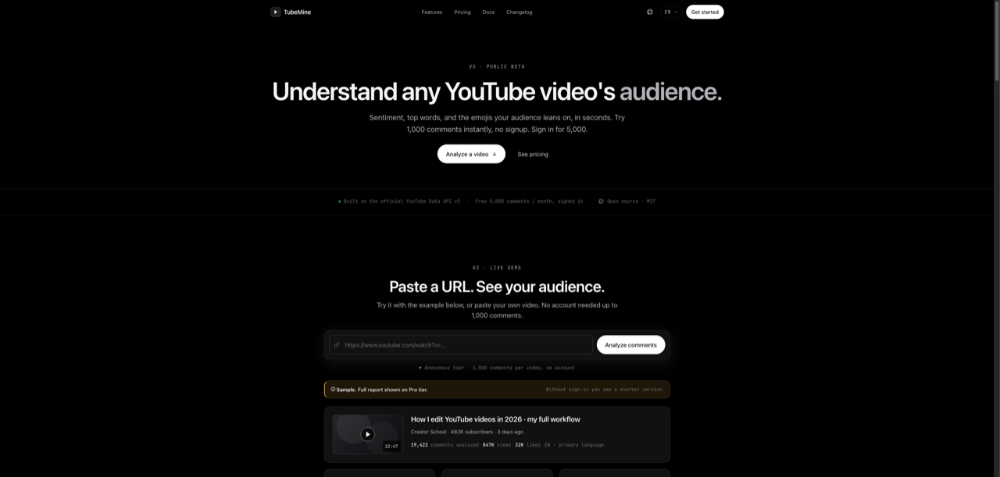
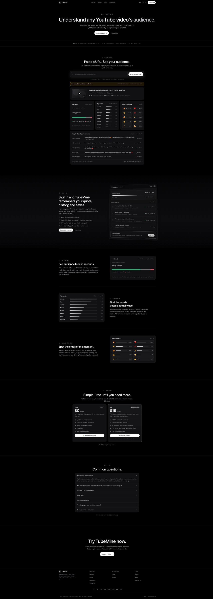
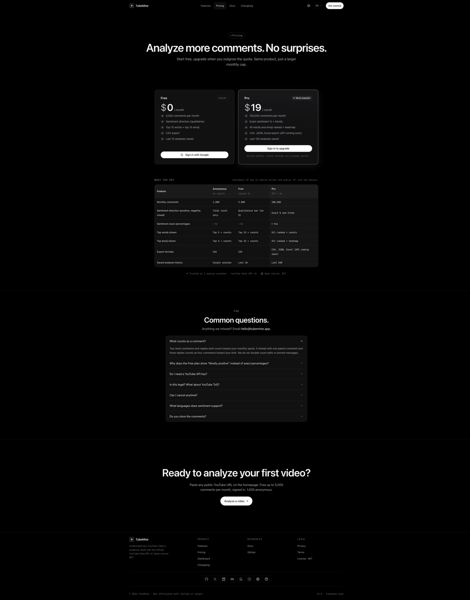
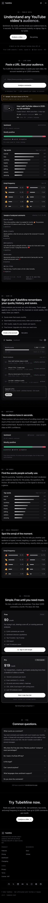
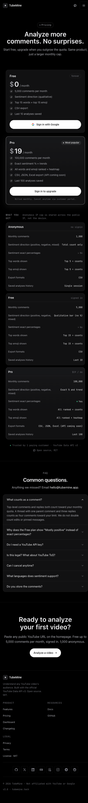

# TubeMine

> Paste any YouTube URL. Get sentiment, top words, and emoji insights in seconds. Free 5,000 comments per month. Open source, MIT.

[](./LICENSE)
[](https://tubemine.tech)
[](https://nextjs.org)

**[tubemine.tech](https://tubemine.tech)**



## Contents

- [What it does](#what-it-does)
- [Features](#features)
- [See it in action](#see-it-in-action)
- [Plans](#plans)
- [How it works](#how-it-works)
- [Stack](#stack)
- [Local dev](#local-dev)
- [Deployment](#deployment)
- [Roadmap](#roadmap)
- [Contributing](#contributing)
- [License](#license)

## What it does

Paste a YouTube URL, get instant audience analytics over every comment: sentiment skew (positive, neutral, negative), the words people actually use, and the emojis the audience reaches for. Signed-in users get a quota meter, history of past analyses, and CSV results. Pro users get exact sentiment percentages, hour-of-day trends, plus JSON and Excel formats.

For creators, marketing analysts, ML researchers, indie devs, and anyone who wants the audience signal in seconds.

## Features

- **Sentiment analysis** on every comment (positive, neutral, negative). Free shows direction. Pro shows exact percentages and hour-of-day trends.
- **Top words** ranked by frequency. Free shows top 15. Pro shows all ranked.
- **Emoji frequency** insights. Free shows top 15. Pro shows all ranked plus a heatmap.
- **CSV results** for Anonymous and Free tiers. Pro adds JSON and Excel.
- **3-day free Pro trial**, then $19 per month. Cancel anytime via the customer portal.
- **EN and RU bilingual** UI. Russian sentiment is in experimental beta.
- **No YouTube API key required.** TubeMine uses its own quota with the official YouTube Data API v3.
- **Open source, MIT licensed.** Self-host, fork, or contribute.

## See it in action

| Landing (desktop) | Pricing (desktop) |
| :---: | :---: |
| [](https://tubemine.tech) | [](https://tubemine.tech/en/pricing) |

| Landing (mobile, 375px) | Pricing (mobile, 375px) |
| :---: | :---: |
|  |  |

## Plans

| | Anonymous | Free | Pro |
| --- | --- | --- | --- |
| Monthly comments | 1,000 | 5,000 | 100,000 |
| Account | No (per IP cap) | Google sign-in | Required |
| Sentiment | Total count only | Direction (qualitative) | Exact percentages plus trends |
| Top words | Top 5 plus counts | Top 15 plus counts | All ranked |
| Top emoji | Top 5 plus counts | Top 15 plus counts | All ranked plus heatmap |
| Result formats | CSV | CSV | CSV, JSON, Excel (API coming soon) |
| Saved analyses | Single session | Last 10 | Last 100 |
| Price | $0 | $0 | $19 / month |

Anonymous visitors get 1,000 comments per IP per video. Free signed-in users get 5,000 per month per account. Pro is $19 a month with a 3-day free trial. Full comparison and FAQ at [tubemine.tech/pricing](https://tubemine.tech/en/pricing).

## How it works

1. **Paste a public YouTube URL.** The video resolves via `videos.list`, returning title, channel, view, like, and comment counts so you confirm the right video before analyzing.
2. **Analyze.** Comments are loaded via `commentThreads.list` (paginated, top-level only), then run through sentiment, top-words, and emoji pipelines server-side.
3. **Read or save.** Results render in the browser. CSV is built client-side via Papa Parse (`author, text, likes, replies, publishedAt`). Pro adds JSON and Excel via `/api/export`.

Quota enforcement: anonymous monthly budget per IP via Vercel KV (Upstash Redis); per-user budget via Postgres with an atomic `bump_usage` RPC (race-free).

## Stack

- **Next.js 16** (App Router) + TypeScript
- **Tailwind CSS v4** + shadcn/ui on Base UI primitives (base-nova design system)
- **next-intl** for EN and RU localization
- **YouTube Data API v3** via [`@googleapis/youtube`](https://www.npmjs.com/package/@googleapis/youtube)
- **Supabase** (Postgres + Auth) for accounts, quotas, subscriptions
- **Polar.sh** for subscription billing and customer portal
- **Resend** for transactional email
- **Vercel KV (Upstash Redis)** for per-IP anonymous budget
- **Papa Parse** for client-side CSV
- **exceljs** (server-only) for Excel
- **Zod + react-hook-form** for input validation
- **Vitest + Testing Library** (82 tests, jsdom + RTL)
- Hosted on **Vercel**, custom domain **tubemine.tech** via PS.KZ DNS

## Local dev

```bash
pnpm install
cp .env.example .env.local
# Fill in YT_API_KEY, KV_*, Supabase, Polar, Resend keys
pnpm dev
```

### Required env vars

See [`.env.example`](./.env.example) for the full list:

```
YT_API_KEY
KV_REST_API_URL
KV_REST_API_TOKEN
NEXT_PUBLIC_SUPABASE_URL
NEXT_PUBLIC_SUPABASE_ANON_KEY
SUPABASE_SERVICE_ROLE_KEY
POLAR_ACCESS_TOKEN
POLAR_WEBHOOK_SECRET
POLAR_PRODUCT_PRO_ID
NEXT_PUBLIC_POLAR_SERVER (sandbox | production)
RESEND_API_KEY
NEXT_PUBLIC_ORIGIN
CRON_SECRET (production only)
```

### Database migration

```bash
# Apply 00_init.sql via Supabase Studio (SQL editor) or CLI
supabase db push
```

The migration creates `profiles`, `usage`, `subscriptions`, `webhook_events` tables with RLS enabled, the `handle_new_user` trigger to auto-create a profile on signup, and the `bump_usage` RPC for atomic quota increments.

### Polar setup

1. Create an org at <https://polar.sh>.
2. Create a Pro product ($19 per month recurring) and copy its product ID into `POLAR_PRODUCT_PRO_ID`.
3. Generate an Organization Access Token; set `POLAR_ACCESS_TOKEN`.
4. Add a webhook endpoint pointing at `https://<your-domain>/api/polar/webhook` and copy the signing secret into `POLAR_WEBHOOK_SECRET`. Subscribe to: `subscription.created`, `subscription.active`, `subscription.updated`, `subscription.canceled`, `subscription.revoked`.

### Resend setup

1. Create an account at <https://resend.com>.
2. Generate an API key; set `RESEND_API_KEY`.
3. Until your custom domain is verified, emails ship from `onboarding@resend.dev` (sandbox). Override by setting `RESEND_FROM` to a verified sender like `TubeMine <noreply@yourdomain.com>`.

## Deployment

TubeMine ships to Vercel. Production runs at [tubemine.tech](https://tubemine.tech) with the custom domain bound via PS.KZ DNS (apex + www both resolve, SSL provisioned by Vercel).

1. Push to `main`; Vercel auto-deploys.
2. Configure the env vars listed above in Project Settings, Environment Variables.
3. Bind your custom domain in Project Settings, Domains (Vercel handles SSL).
4. Optional: configure a Vercel Cron at `/api/internal/cron/purge-analyses` for daily comment-cache purge.

## Roadmap

- **Phase 0** (shipped 2026-05-15): anonymous prototype, per-IP monthly budget.
- **Phase 1** (shipped 2026-05-17): Supabase Auth, Polar Pro plan, per-user quotas, dashboard.
- **Phase 2 + TUB-1** (shipped 2026-05-20): v3 visual port across 9 pages, sentiment Pro tier, tier-aware results, comparison table, profile rebuild.
- **TUB-11** (shipped 2026-05-21): branding (logo, favicon, PWA icons, OG image).
- **Next:** OAuth verification submission, per-user 10k / day YouTube quota migration.

## Contributing

Contributions welcome under the MIT license. To get started:

1. Fork the repo and create a feature branch.
2. Run `pnpm install` and `pnpm dev`.
3. Make changes. Tests live in `*.test.tsx` and `*.test.ts` files; run `pnpm test`.
4. Lint with `pnpm lint`. Typecheck via `next build`.
5. Open a PR against `main` with a clear description.

## License

[MIT](./LICENSE). Use it, fork it, ship it.

---

Last updated: 2026-05-21
