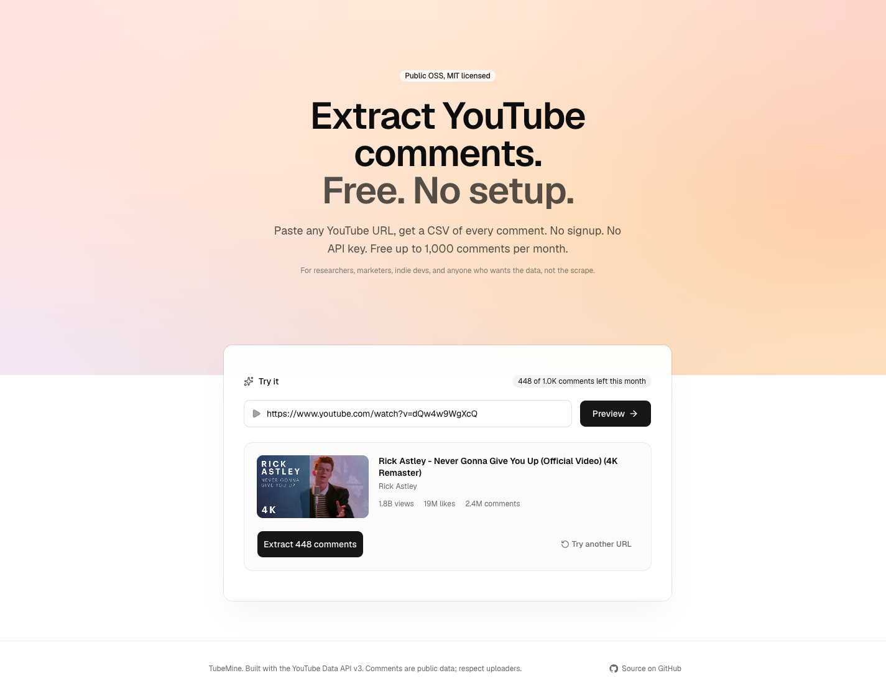

# TubeMine

> YouTube audience analytics: sentiment, top words, and emoji insights via the YouTube Data API. Free. No setup.

[**tubemine.vercel.app**](https://tubemine.vercel.app)



## What it does

Paste a YouTube URL, get instant audience analytics across every comment: sentiment skew (positive / neutral / negative), top words, and the emojis the audience leans on. Signed-in users can also export the comment dataset as CSV.

For creators, marketing analysts, ML researchers, indie devs, and anyone who wants the signal, not a scrape.

## Plans

| | Free | Pro |
| --- | --- | --- |
| Comments per month | 1,000 | 100,000 |
| Account | Optional | Required |
| Price | $0 | $19 |

Anonymous users get 1,000 comments per month per IP. Signed-in users get a per-account budget instead.

## How it works

1. **Preview** (1 quota unit) - `videos.list` returns title, channel, view/like/comment counts so you confirm before extracting.
2. **Extract** (1 quota unit per page of 100 comments) - `commentThreads.list` paginated, sorted by time, top-level only.
3. **Download** - Papa Parse turns the JSON into CSV client-side; columns are `author, text, likes, replies, publishedAt`.

The anonymous monthly budget is enforced server-side via Vercel KV (Upstash Redis). The per-user budget is enforced via Postgres using an atomic `bump_usage` function (race-free).

## Stack

- Next.js 16 (App Router) + TypeScript
- Tailwind CSS v4 + shadcn/ui (Base UI)
- YouTube Data API v3 via [`@googleapis/youtube`](https://www.npmjs.com/package/@googleapis/youtube)
- Supabase (Postgres + Auth) for accounts, quotas, subscriptions
- Polar.sh for subscription billing
- Resend for transactional email
- Vercel KV (Upstash Redis) for per-IP budget
- Papa Parse for CSV export
- Zod + react-hook-form for input validation
- Hosted on Vercel

## Local dev

```bash
pnpm install
cp .env.example .env.local
# Fill in YT_API_KEY, KV_*, Supabase, Polar, Resend keys
pnpm dev
```

### Required env vars

See [`.env.example`](./.env.example) for the full list. Phase 1 introduces:

```
NEXT_PUBLIC_SUPABASE_URL
NEXT_PUBLIC_SUPABASE_ANON_KEY
SUPABASE_SERVICE_ROLE_KEY
POLAR_ACCESS_TOKEN
POLAR_WEBHOOK_SECRET
POLAR_PRODUCT_PRO_ID
NEXT_PUBLIC_POLAR_SERVER (sandbox|production)
RESEND_API_KEY
NEXT_PUBLIC_ORIGIN
```

### Database migration

```bash
# Apply 00_init.sql via Supabase Studio (SQL editor) or CLI
supabase db push    # if using supabase CLI with a linked project
```

The migration creates `profiles`, `usage`, `subscriptions`, `webhook_events` tables with RLS enabled, the `handle_new_user` trigger to auto-create a profile on signup, and the `bump_usage` RPC for atomic quota increments.

### Polar setup

1. Create an org at <https://polar.sh>.
2. Create a Pro product ($19/month recurring) and copy its product ID into `POLAR_PRODUCT_PRO_ID`.
3. Generate an Organization Access Token; set `POLAR_ACCESS_TOKEN`.
4. Add a webhook endpoint pointing at `https://<your-domain>/api/polar/webhook` and copy the signing secret into `POLAR_WEBHOOK_SECRET`. Subscribe to: `subscription.created`, `subscription.active`, `subscription.updated`, `subscription.canceled`, `subscription.revoked`.

### Resend setup

1. Create an account at <https://resend.com>.
2. Generate an API key; set `RESEND_API_KEY`.
3. Until your custom domain is verified, emails ship from `onboarding@resend.dev` (sandbox). Override by setting `RESEND_FROM` to a verified sender like `TubeMine <noreply@yourdomain.com>`.

## Roadmap

- **Phase 0** (shipped 2026-05-15): anonymous prototype, per-IP monthly budget
- **Phase 1** (this release): Supabase auth + Polar Pro plan + per-user quotas + dashboard
- **Iteration 2**: Google OAuth migration (per-user 10k/day YouTube quota, scales infinitely)

## License

MIT. See [LICENSE](./LICENSE).
